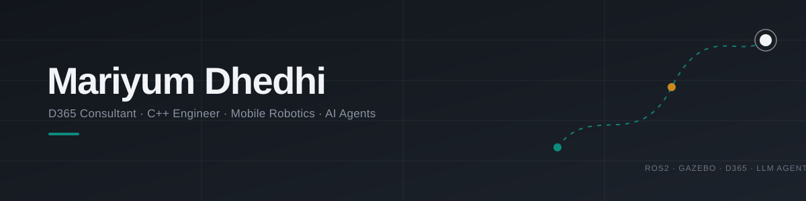

  

  

  
  
  

---

### About me

Software engineer who redefines what business software can do — 3+ years
building for corporate clients, with a sharp eye on where the tech is headed.
I build secure, custom software and scalable ERP solutions that streamline
and automate operations. But I don't stop at automation — I integrate LLMs
and AI agents into workflows, turning static processes into systems that
adapt in real time.

Right now I'm also doing something most ERP consultants aren't: going back
to first principles in a Mobile Robotics M.Sc. at Uni Bonn — ROS 2, Gazebo,
SLAM, sensor fusion. Same underlying obsession either way: how do you get a
system (business process or robot) to make good decisions with incomplete
information, fast.

- 👋 Hi, I'm Mariyum — D365 technical consultant, C++ engineer, robotics
  grad student, in no particular order
- 👀 Interested in ERP/D365 architecture, autonomous navigation, and the
  overlap between the two (more than you'd think)
- 🌱 Currently deepening React, Node.js and MongoDB — and documenting how I
  use Claude Code as an actual part of the build, not just autocomplete
- 💞️ Open to collaborating on AI-agent-driven automation projects and
  full-stack builds
- 🔭 Latest build: [Deskline](https://github.com/Mariyum-Dhedhi/deskline-ticketsystem) —
  a full-stack support ticket system, built and documented as an
  agent-driven-development case study
- 📫 Reach me at [maryamdhedhi6@gmail.com](mailto:maryamdhedhi6@gmail.com)

### Tech stack

  

- **ERP & Enterprise:** Dynamics 365 F&O · X++ · Azure Functions & Logic Apps · Copilot Studio · Warehouse Management App customizations · Business Events · Data Entities · SSRS Reports · COCs · Workflows · Azure Pipeline · LCS · Electronic Reporting · CE Integrations · Odata 
- **Web:** React · Node.js/Express · MongoDB · REST APIs
- **AI & Automation:** LLM/agent integration into business workflows · Claude Code
- **ML & Data:** Linear Regression, Logistic Regression, KNN, K-Means, Computer Vision
- **Robotics & Simulation:** ROS 2 · Gazebo · Path Planning & Navigation Basics · SLAM Fundamentals · Sensor Integration · OpenCV · Reinforcement Learning
- **Cloud & Azure**: Azure Function Apps · Azure Service Bus · Azure Logic Apps · Azure DevOps · Azure Pipeline · LCS
- **DBMS**: Firebase · SQL Server Reporting Services · SQLite Room
- **Tools/IDES**: Postman · Bruno · VS Code · Visual Studio · IntelliJ · Unity 3D · GitLab · GitHub · TFVC
- **Version Controls**: Azure DevOps · TFVC · GitLab · GitHub

### Featured project

<table>
  <tr>
    <td width="140">
      
    </td>
    <td>
      <b><a href="https://github.com/Mariyum-Dhedhi/deskline-ticketsystem">Deskline</a></b> — full-stack support ticket system 
      React · Node/Express · MongoDB · built with a documented agent-driven workflow
    </td>
  </tr>
</table>

<table>
  <tr>
    <td width="140" align="center">
      
    </td>
    <td>
      <b><a href="https://github.com/Mariyum-Dhedhi/esg-portfolio-reporting">ESG Portfolio Reporting</a></b> — portfolio analytics & ESG reporting dashboard 
      Python · Streamlit · ESG metrics · Data visualization · Portfolio performance reporting
    </td>
  </tr>
</table>

### Contribution snake 🐍

  

---

Bonn, Germany · open to work

